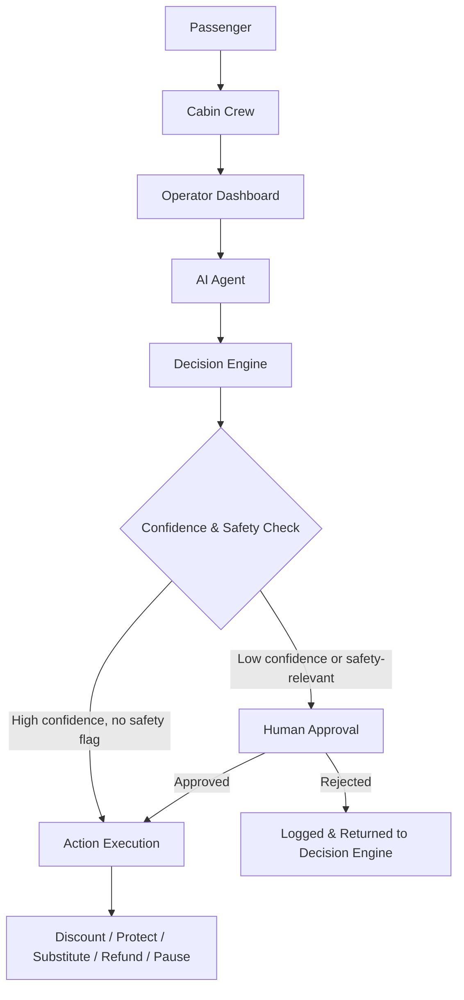

# Gate2Tray

**Gate2Tray is an AI-powered commerce platform that turns airline meal inventory from a manual, reactive process into a continuously monitored, human-approved decision system.**

---

## Problem

In-flight meal programs run on stale information and manual coordination. Cabin crew report meal counts by radio or paper, operators react hours after a shortage or surplus has already occurred, and passengers see menu items that are frequently unavailable by the time they order.

This produces a consistent set of failures across the industry:

- **Excess inventory** — meals are loaded based on forecasts, not real-time demand, leading to waste that is costly and hard to track.
- **Sold-out meals** — popular items run out mid-flight with no mechanism to redirect demand before passengers are disappointed.
- **Supplier shortages** — catering shortfalls surface at the gate, leaving no time to adjust pricing or communicate substitutions.
- **Incorrect inventory data** — manual counts drift from actual stock, so dashboards show numbers nobody trusts.
- **Safety restrictions** — allergen, temperature, and handling constraints are enforced manually and inconsistently.
- **Manual refunds** — resolving a sold-out or incorrect order requires crew intervention and delays passenger reimbursement.
- **Poor operator–crew communication** — decisions about discounting, substituting, or pausing sales are made ad hoc, without a shared source of truth.

Each of these is individually solvable with more staffing or process discipline. Together, they represent a systemic gap: there is no continuous, automated layer connecting operational signals to commercial decisions.

---

## Solution

Gate2Tray closes that gap with an AI agent that sits between operational data and commercial action.

The agent continuously ingests operational signals — inventory counts, sales velocity, supplier updates, and safety flags — from every point in the workflow: passenger orders, cabin crew input, and the operator dashboard. Rather than surfacing raw data and waiting for a human to interpret it, the agent evaluates the signal and recommends a specific action:

- Discount a meal that is at risk of going unsold
- Protect remaining inventory for a category running low
- Suggest an alternative when a requested item is unavailable
- Issue a refund when an order cannot be fulfilled
- Pause sales of a meal that has hit a safety or stock threshold

Every recommendation carries a confidence score. High-confidence, low-risk actions can execute automatically within defined guardrails. Low-confidence or safety-relevant actions are routed to a human — an operator or crew member — for explicit approval before anything happens. Gate2Tray does not replace operator and crew judgment; it removes the latency and guesswork between a signal and a decision, while keeping a person in control of anything consequential.

---

## Features

| Feature | Description |
|---|---|
| **Inventory Monitoring** | Continuous tracking of meal stock, sales velocity, and supplier status across passengers, crew, and operator systems, replacing manual counts with a live operational picture. |
| **AI Recommendations** | The agent translates raw signals into specific, ranked actions — discount, protect, substitute, refund, or pause — rather than leaving interpretation to the operator. |
| **Human-in-the-Loop Approval** | Actions below a confidence threshold, or that touch safety-restricted items, are held for explicit human approval before execution. Nothing consequential happens without a person in the loop. |
| **Multi-Role Workflow** | Passengers, cabin crew, and operators interact with a shared decision pipeline instead of disconnected tools, so everyone acts on the same data. |
| **Real-Time Decision Support** | Recommendations and approvals happen in-flight and at the gate, on the timescale the problem actually occurs at — not in a post-flight report. |

---

## AI Workflow

The agent never acts in isolation. Every recommendation passes through the Decision Engine, which evaluates confidence and safety criteria before deciding whether to execute automatically or escalate to a human.

---

## Enterprise AI Principles

Gate2Tray is built around a small set of principles that govern how the agent is allowed to behave in production, not just how it performs on a demo.

- **Human-in-the-Loop** — The agent recommends; it does not unilaterally decide on anything with safety, refund, or significant commercial impact. Humans remain the final authority on consequential actions.
- **Responsible AI** — Recommendations are scoped to the operational domain the agent has evidence for. The system is designed to abstain or escalate rather than guess when signals are incomplete.
- **Confidence Threshold** — Every recommendation carries a quantified confidence score. Actions above the threshold and outside safety scope may auto-execute; everything else is routed for approval.
- **Safety** — Allergen, handling, and regulatory constraints are hard gates, not soft signals. Any action touching a safety-flagged item is routed to a human regardless of confidence score.
- **Explainability** — Every recommendation is delivered with the signals and reasoning behind it, so operators and crew can approve, reject, or override with full context rather than acting on a black box.

---

## Tech Stack

**Frontend:**
**Backend:**
**LLM:**
**Database:**
**Deployment:**
**Cloud:**

---

## Future Roadmap

- **Multi-agent architecture** — decompose the single agent into specialized agents (inventory, pricing, safety, communication) coordinated by a shared decision layer.
- **Predictive inventory** — move from reactive monitoring to forecasting stock-out and surplus risk before it occurs.
- **Demand forecasting** — model route-, time-, and passenger-level demand to inform loading decisions before departure.
- **Dynamic pricing** — extend discount recommendations into a continuous pricing model responsive to real-time demand and remaining inventory.
- **Crew copilots** — give cabin crew a conversational interface into the agent for in-flight decisions, not just a dashboard.
- **Airport integration** — connect gate-level catering and logistics systems so supplier shortages are visible before boarding, not after.

---

## Why This Matters

Gate2Tray is not a chatbot layered on top of an airline app. It is a decision system operating inside a real commercial and safety-constrained workflow, with the properties that distinguish enterprise AI deployments from conversational demos:

- It acts on **continuous operational signals**, not single-turn user prompts.
- It produces **structured, auditable recommendations** with confidence scores, not open-ended text.
- It enforces **hard safety and approval gates**, reflecting the reality that airline operations cannot tolerate unchecked automation.
- It is designed around **multiple roles** (passenger, crew, operator) collaborating through the same system, reflecting how enterprise workflows actually function.
- It treats **human oversight as a first-class design constraint**, not an afterthought bolted on for compliance.

This is the shape of AI deployment that enterprises in regulated, safety-critical industries actually need: an agent that augments operational decision-making under clear, explainable, and reversible controls.

---

## Screenshots

_Coming soon._

<!--  -->
<!--  -->
<!--  -->

---

## Contributors

| Name | Role |
|---|---|
| _TBD_ | _TBD_ |
| _TBD_ | _TBD_ |
| _TBD_ | _TBD_ |
