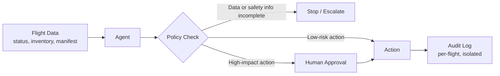

# Gate2Tray — Customer Engineering Case Study

## Customer Problem

Airlines running day-of-operations (IROPS: delays, cancellations, equipment swaps)
have to make fast, per-flight decisions — rebooking, meal/service substitutions,
refunds, and service resumption — under safety and regulatory constraints. Today
this work is split across disconnected ops tools and manual judgment calls, which
creates two risks at once: slow response when passengers need answers, and
inconsistent or unsafe decisions when the underlying flight data is incomplete.
Any automation touching pricing, substitutions, or service resumption has to be
trustworthy enough for an ops team to actually rely on, not just fast.

## Solution Architecture

Data → Agent → Policy Check → Human Approval → Action → Audit Log

The agent proposes actions per flight, but every proposal passes through a policy
check before anything executes. Incomplete data halts the flow instead of
producing a best-guess action. Actions with real customer or financial impact —
price changes, meal/service substitutions, resuming service — route to a human
approver before execution. Every action, approved or not, is written to a
per-flight audit log.

## Key Design Decisions

- **Bounded agent over full autonomy.** The agent is designed to stop when
  flight data or safety information is missing, rather than filling the gap
  with a plausible-sounding guess. In an operational aviation context, a wrong
  autonomous action carries real safety and financial cost, so "I don't have
  enough information" is a valid and preferred output.
- **Human-in-the-loop only where it matters.** Approval gates are scoped to
  irreversible or high-stakes actions (pricing, substitutions, resuming
  service) rather than every action — this keeps the system fast for routine
  cases while keeping a human accountable for the decisions that actually
  carry risk.
- **Per-flight audit trail and state isolation.** Keeping each flight's data
  and action history isolated prevents cross-flight leakage and gives ops and
  compliance teams a clean record to review after the fact.
- **Security limitations stated explicitly.** The current build is a demo
  without real authentication or payments, and that limitation is documented
  directly rather than implied — so anyone evaluating it calibrates trust
  correctly instead of assuming production-readiness.

## My Contribution

*(Team project — filling this in accurately matters more than filling it in
completely. Replace each line below with what you specifically owned; delete
any that don't apply.)*

- **Customer problem definition:** —
- **Product / agent flow design:** —
- **Demo / walkthrough:** —
- **GTM or technical design:** —
